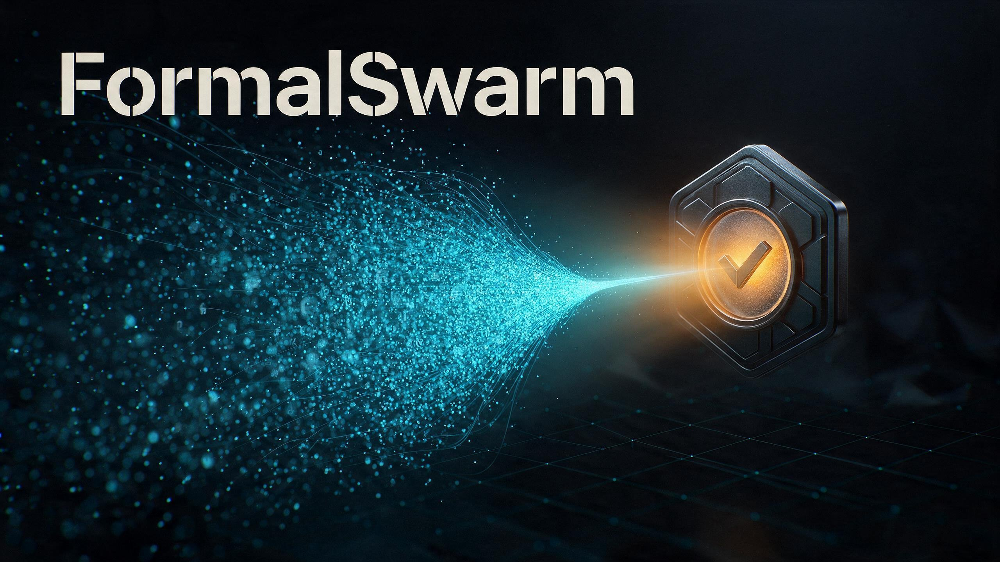

<p align="center">
  
</p>

# FormalSwarm



**Don't settle for an AI answer. Make it survive a debate — and a check.**

FormalSwarm helps agents propose solutions, challenge assumptions, and verify the claims
that can actually be tested. Start with **a codebase or a folder of documents**: a change
to review, a funnel to design, or a plan to stress-test.

Independent agents write *theses*, adversarial critics challenge them, and a *seal* runs
real commands. A deterministic rollup computes `CONFIRM`, `REVISE`, or `INCONCLUSIVE`
from reported checks, exit codes and case counts — not a confidence score. The verdict
covers the checks you defined, not every recommendation the agents make.

Built for repositories, also usable for **guided, document-driven problem solving**.
From a 6-agent pilot to hundreds of agents, on DeepSeek Harness, Claude Code and ZCode
from one and the same code.

[](https://github.com/fashionmascherine-svg/formalswarm/actions/workflows/ci.yml)
[](LICENSE)
[](package.json)


[](https://github.com/fashionmascherine-svg/formalswarm/discussions)

**[Start with code](#the-60-second-version) · [Start with documents](#beyond-code-turn-documents-into-a-testable-plan) · [Install](#install) · [Check the proof](#verify-it-yourself-in-30-seconds)**

> More agents can give you more ideas. FormalSwarm gives those ideas an adversary —
> and gives testable claims a check. If that is how you want agents to work,
> **[star FormalSwarm](https://github.com/fashionmascherine-svg/formalswarm)**.

---

## Beyond code: turn documents into a testable plan

**No Git repository required. Bring the problem, the documents, and the constraints.**

You can use FormalSwarm to develop and challenge solutions outside software: a funnel,
launch plan, operating process, or resource allocation. The proposals come from the
agents; FormalSwarm structures their debate and checks the measurable claims. These
are applications of the same protocol, not built-in specialist tools or a guarantee
that every kind of problem can be decided automatically.

### Example: design a funnel from a folder

Open a workspace folder in your coding agent and give it 3–6 context files. Plain text,
Markdown, JSON, and readable data exports work well; extract PDFs or other binary
formats into readable files first. You do **not** need application code or Git.

```text
funnel-project/
  objective.md       # Desired outcome, audience, and what success means
  offer.md           # Product/service facts, prices, verified promises, source links
  constraints.md     # Spending cap, timing, capacity, and approval boundaries
  current-journey.md # Existing ads, pages, calls to action, and known friction
  evidence.csv       # Optional: actual observations with units and date ranges
```

Missing evidence is useful information too. If you have no results yet, say so in the
brief instead of filling the gap with invented numbers. Label illustrative figures as
assumptions, not observations. Keep customer data and secrets out of shared materials.

After installing the plugin, explicitly ask your agent to use FormalSwarm. For example:

```text
Use FormalSwarm on this folder to propose a better acquisition funnel.

Read objective.md, offer.md, constraints.md, and current-journey.md.
Produce two independent proposals, challenge their assumptions, and identify
which parts can actually be verified from the available evidence.

For each proposal, explain the audience, message, destination page, primary
action, follow-up, spending allocation, and measurement plan. Distinguish
source facts, assumptions, recommendations, and measured results.

Before starting the debate, define the verdict question and runnable checks.
Use 2 thesis writers, 2 critics, and 2 seal verifiers, with one round and a
maximum of 6 agent calls. Keep all source documents unchanged; put drafts and
verification scripts in scratch. Do not publish, spend, or contact anyone.

Return a recommended plan with trade-offs, the objections and open questions,
and the computed verdict with its exact scope. Do not interpret a sound budget
or a complete plan as proof that the funnel will improve real-world results.
```

This is an instruction to the **host agent**, not a new CLI command or an unattended
campaign builder. The host must turn it into a brief, prepare meaningful checks, run
the offline gate, and orchestrate the rounds. The current role prompts remain
engineering-oriented, so explicitly describing the non-code task matters.

### What each group does with documents

1. **Thesis writers propose solutions.** They read the same source documents in isolated
   contexts and defend concrete alternatives. For a funnel, one might recommend a
   direct-conversion journey, another an assisted journey. These are hypotheses to
   evaluate, not automatically proven winners.
2. **Critics challenge the reasoning.** They check the proposals against the documents:
   unsupported promises, incompatible constraints, omitted costs, unnecessary steps,
   or a measurement plan that counts activity instead of the desired outcome.
3. **Optional synthesis answers objections.** With `--rounds 2`, challenged writers
   respond to the critique; the host must allow the larger call budget. One round
   leaves proposals and objections for the final review without this response phase.
4. **Seal verifiers execute the checks.** They can recompute allocations, validate
   structured data, or run an appropriate analysis over supplied observations. Taste,
   persuasion, and future demand do not become facts because an agent scores them.
5. **The host presents the solution and the evidence separately.** The recommended plan
   is an argued synthesis. `outcome.json` is the computed verdict on the assigned
   checks. An untested recommendation must not inherit their confirmation.

### Define a question the evidence can answer

Instead of one broad question — *"Will this funnel work?"* — separate the decisions:

| Question | Evidence or check | What remains unproven |
|---|---|---|
| Does the allocation fit the spending cap? | Recompute duration × daily allocations, including declared costs | Actual delivery and effectiveness |
| Are the supplied results internally consistent? | Validate nonempty records, units, totals, and duplicates | Causality and future performance |
| Does the proposed journey improve the desired outcome? | An appropriate real experiment and a reviewed analysis with predefined criteria | Anything outside that experiment's scope |

A script that merely finds the word "conversion" in a plan does not validate the
plan's effectiveness. Neither does a second model giving it 9/10. The rollup checks
reported outcomes and coverage; it cannot make a poorly chosen test meaningful.

### How the folder enters the existing workflow

The same `init`, `brief`, and `run` flow applies. Point `--repo` at the document folder;
the flag name does **not** mean Git is mandatory. With no stack or runner detected,
the profile reports `stack: unknown` and no test command. Supply explicit seal checks.

For hosts building the brief through the CLI, the shape is:

```sh
# Use the FS command resolved for your installed plugin (see the quickstart below).
$FS init --repo ./funnel-project
$FS brief --repo ./funnel-project \
  --objective "Develop a funnel within the documented constraints" \
  --verdict-question "Does the proposed allocation fit the documented spending cap?" \
  --context objective.md,offer.md,constraints.md,current-journey.md \
  --seal "node .formalswarm/scratch/check-budget.cjs" \
  --thesis 2 --critics 2 --seals 1 --rounds 1 --max-calls 5
```

This is a **template**, not a bundled funnel demo: the documents and
`check-budget.cjs` must exist first. Have the host create and review that check against
an explicit candidate allocation in scratch, then run it from the document folder or
use absolute paths. It must be able to fail, return a real exit status, and count the
actual cases evaluated. The single verifier here matches the single assigned check;
use more verifiers only when there are enough checks to assign.

Run `$FS validate` before launching. Then use `$FS run <generated-brief.json>` and the
[host-agent round loop](skills/formalswarm/references/runtimes.md): execute final pending
prompts, save their answers, and repeat until the driver writes `outcome.json`.
A standalone `run` command does not itself supply the host's subagent tools.

### Tried with documents, not just described

A guided local funnel pilot completed with the **unmodified plugin**, a non-Git folder,
three context documents, and three real agents: one writer, one critic, one verifier.
The host prepared the documents and checks; no campaign was launched. With deliberately
synthetic inputs, the original allocation was **700 against a cap of 600**. The budget
check failed with `exit_code: 1` and `cases: 1`; the driver returned **`REVISE`**.
A proposed allocation of 560 passed a separate arithmetic check, not a second global
approval. Real-world effectiveness remained unmeasured: the explicit missing-evidence
placeholder reported `not_run` with zero cases; it was not an effectiveness analyzer.

This establishes a guided non-code workflow, not a benchmark of solution quality or
commercial success. The pilot artifacts are local, not bundled as a reproducible
example in this repository. **The useful outcome is a better-specified plan, visible
assumptions, and clear next measurements — not certainty invented by a swarm.**

---

## The 60-second version

```sh
# from a checkout
FS="node ./core/bin/formalswarm.js"

# once the plugin is installed, resolve it from wherever the runtime put it:
#   Claude Code   FS="node $CLAUDE_PLUGIN_ROOT/core/bin/formalswarm.js"
#   ZCode         FS="node $ZCODE_PLUGIN_ROOT/core/bin/formalswarm.js"
#   any runtime   FS="node $(node -p "require('path').dirname(require.resolve('formalswarm/package.json'))")/core/bin/formalswarm.js"

$FS init                                   # profile this repository
$FS brief \
  --objective "Make cache eviction deterministic under concurrent writes" \
  --verdict-question "Does the cache evict deterministically under concurrent writes?" \
  --context src/cache.py,src/locks.py,tests/test_cache.py \
  --seal "python3 -m pytest -q tests/test_cache.py" \
  --seal "python3 -m pytest -q -k concurrency"
# -> brief.json, with the prompts and the repository profile already embedded
```

Then run it. You get one file, `<scratch>/outcome.json`:

```jsonc
{
  "global_verdict": {
    "outcome": "REVISE",
    "reason": "at least one seal check fails (exit_code != 0) or a verifier declares REVISE",
    "warnings": ["2 objection(s) were filed by a critic outside its assigned partition ..."]
  },
  "objection_count": { "total": 9, "accepted": 8, "rejected": 1, "unanswered": 0, "orphan": 0 },
  "verdict_review": [
    { "verifier": "seal-1", "declared": "REVISE", "effective": "REVISE", "coherence": "ok",
      "notes": [] },
    { "verifier": "seal-2", "declared": "CONFIRM", "effective": "CONFIRM", "coherence": "ok" }
  ],
  "seal_verdicts": [ { "checks": [ { "command": "python3 -m pytest -q -k concurrency",
                                     "outcome": "failed", "exit_code": 1, "cases": 6 } ] } ]
}
```

Anyone can recompute that verdict. Nobody has to trust a paragraph.

---

## Verify it yourself in 30 seconds

Zero agent calls, no API key, no network:

```sh
node core/validate-all.js   # -> ALL SUITES GREEN — 114 checks (body 48, driver 24, profile 23, generic 19)
node tests/smoke-e2e.js     # builds real throwaway projects, spawns the seal commands, asserts real exit codes
```

Both must exit `0`. The first is the whole offline gate: every rollup branch, driver
identity, profiler fixture and genericity guard, counted one by one — 114 lines of
proof, about four seconds. The second needs `python` (or `python3`) on `PATH` for its
fixture toolchain.

## A verdict this repository computed about itself

FormalSwarm's first published debate ran on FormalSwarm itself: 5 theses, 5 critics,
5 seal verifiers, 6 real commands, 15 agent calls. The rollup returned **REVISE** —
read straight from `outcome.json`:

```jsonc
{
  "global_verdict": {
    "outcome": "REVISE",
    "reason": "at least one seal check fails (exit_code != 0) or a verifier declares REVISE",
    "warnings": ["phase ANTITHESIS: 1 fallen agent(s)"]
  },
  "objection_count": { "total": 11, "accepted": 0, "rejected": 0, "unanswered": 0, "to_answer": 11, "orphan": 0 }
}
```

What the 15 agents actually measured:

- Every **assigned** seal check was green with counted cases: the offline gate
  (`node core/validate-all.js`, `exit_code: 0`, `cases: 110`), the end-to-end smoke
  (`node tests/smoke-e2e.js`, `exit_code: 0`, `cases: 6`, a green fixture reaching
  `CONFIRM` and a broken one `REVISE` quoting the real exit code), and the driver and
  genericity suites. The installed plugin copy passed the same gate in place.
- All five verifiers **independently reproduced the one blocking objection** with their
  own discriminating commands (`exit_code: 1`): the docs claimed any refused spawn
  makes the verdict `INCONCLUSIVE`, while the code enforces that only for a whole
  silent group and for the seal — a partial fall elsewhere was a warning, and the
  suite even pinned the contradicting behavior green.
- One critic fell for a reason the protocol is proud of: its answer missed required
  schema fields, `save` refused it, and the run recorded a fallen agent instead of
  reading a malformed answer.

The fix (narrow the two doc sentences, harden the rollup against out-of-enum outcomes
and non-integer counts, make the gate's temp directories per-process unique, and pin
the real partial-fall semantics with new counted checks) took the gate from 110 to 114
green checks. The verdict was never edited: `REVISE` is what the code computed, and the
corrections came after it.

---

## The problem this exists for

A capable agent reviews a change and writes a confident, well-argued paragraph. It is
often right — and it is still not evidence, because you cannot recompute it. Three
failure modes show up constantly, and none of them is a stupid mistake:

| Failure | What it looks like | Why nothing catches it |
|---|---|---|
| **Empty green** | The command exits `0` having tested nothing (`unittest discover` with no `-s tests` finds zero tests and still exits `0`) | The exit code is genuinely zero; only a *case count* reveals it |
| **Missing evidence** | The reviewer silently skipped one of the things it was asked to check | Nothing compares what was asked against what was answered |
| **Silence as agreement** | One subagent crashed; the summary reads as if everything passed | A dead agent produces no objection, and no objection is read as consent |

FormalSwarm exists to make those three states mechanically visible, and to make the
verdict a *computation* rather than a *judgement*.

## Why not just ask another agent to review it?

Because you would get a second confident paragraph. The difference is not the model —
it is what counts as evidence:

| | A reviewer (human or model) | FormalSwarm |
|---|---|---|
| Evidence that "it works" | prose | real exit codes and counted cases |
| Adversarial pressure | depends on the reviewer | partitioned critics, hunting hallucinations by contract |
| A check that tested nothing | invisible | `cases: 0` → `INCONCLUSIVE` — empty green is a verdict, not a pass |
| A subagent that died | invisible, or worse | `fallen_agents` and warnings — silence is never a vote |
| The final answer | an opinion you re-read | `outcome.json` — a computation anyone can re-run |

---

## The idea, and where it comes from

In September 2026 OpenAI reported a mathematics run in which on the order of **10,000
agents** exchanged millions of messages over 88 hours attacking the Navier–Stokes
Millennium problem, with formal verification in Lean acting as a seal on whatever the
swarm produced — reported at the time by
[WION](https://www.wionews.com/technology/openai-says-10-000-ai-agents-sent-2-7-million-messages-and-generated-130-billion-tokens-to-solve-one-of-maths-biggest-unsolved-problems-in-88-hours-1788941316171).

The interesting part is not the number. It is the **two-part shape**:

1. **Massive, independent, parallel exploration** — many attempts, no shared context,
   no groupthink.
2. **A machine-checked oracle** that does not care how confident anyone sounds.

That shape does not need a Millennium problem. Your repository already owns the oracle:
its test suite, its linters, its measurement scripts. The seal of a FormalSwarm debate
is not Lean — it is *your* commands, with their real exit codes and their real case
counts, and a rollup that fails closed.

**What this is not.** It is not a reproduction of that result; it is that pattern
applied to ordinary software work. And no number of agents makes an unmeasurable claim
measurable: FormalSwarm does not make agents smarter, it makes their output auditable,
and it will happily tell you `INCONCLUSIVE` when the repository cannot decide the
question.

---

## How it works

```
 THESIS            ANTITHESIS           [SYNTHESIS]        SEAL
 n writers   ──▶   m critics      ──▶   only the      ──▶  k verifiers run the
 in parallel       each with a          attacked            checks for real:
 (isolated)        disjoint slice       writers answer      command, exit code,
                   of the theses        their objections    case count, output
                        │                                        │
                        └──────── deterministic rollup ──────────┘
                                       CONFIRM / REVISE / INCONCLUSIVE
```

| Phase | Who | Must produce |
|---|---|---|
| `THESIS` | `n_thesis` writers, isolated subagents | a position, its findings with `path:line` evidence, its risks, and the measurement that would prove it |
| `ANTITHESIS` | `n_critics`, each handed a **disjoint partition** of the theses | objections with re-read evidence: `hallucination`, `dead_control`, `dead_guard`, `logic_bug`, `bad_measurement`, `empty_green`, `safety`, `other` |
| `SYNTHESIS` | only the writers actually attacked (`rounds ≥ 2`) | answers that copy the objection's evidence string verbatim, so the accept/reject count is deterministic |
| `ANTITHESIS-2` | `n_critics` on the revised state with a deterministic board (`rounds = 3`) | genuinely new objections; already-accepted ones are absorbed |
| `SEAL` | `n_seals` verifiers, each with a disjoint slice of your `seal_plan` | `command`, `outcome`, `exit_code`, `cases`, `detail` — and a per-check measurement limit |

The orchestrator never votes. It opens the rounds, executes the subagents, and reads a
verdict that the body computed.

---

## Scale: 6 agents or 600

The default plan is a **2+2+2 pilot** — six agent calls, the right size for a first run
or a new kind of task. Scaling up is a flag, not a redesign:

```sh
# a wide exploration: 60 writers, 40 critics, 40 verifiers, one round
formalswarm brief ... --thesis 60 --critics 40 --seals 40 --max-calls 200

# the full cycle: thesis → antithesis → synthesis → antithesis-2 → synthesis-2 → seal
formalswarm brief ... --thesis 20 --critics 10 --seals 10 --rounds 3 --max-calls 120
```

Group sizes go from 1 to 500; there is no policy ceiling. The only ceiling is the one
you declare:

| Flag | Meaning |
|---|---|
| `--thesis N` / `--critics N` / `--seals N` | size of each group (defaults 2, 2, 2) |
| `--max-calls N` | the budget for the whole run (default 15) — the plan is refused **before the first call** if it would exceed it |
| `--rounds 1\|2\|3` | 1 = thesis + antithesis + seal; 2 = + synthesis; 3 = + second antithesis and synthesis |

Worst case = `thesis + critics + seals + (rounds≥2 ? thesis : 0) + (rounds≥3 ? critics + thesis : 0)`.
Real cost is usually lower: synthesis only runs for writers that were actually attacked,
and idle critics are never spawned.

Two things keep a large run honest rather than merely large:

- **The partition scales with the critics.** Writers are dealt round-robin across the
  critics, so each critic reviews a slice instead of everything. `brief` warns you when
  a critic's slice is getting unreadable (`raise --critics`).
- **The seal brief stays bounded.** Every *blocking* objection always reaches the
  verifiers; long thesis texts and a crowded ledger are clipped with an explicit warning,
  and the full material is always in the scratch files and in `outcome.json`.

The runtime is the final arbiter of concurrency: DeepSeek Harness, Claude Code and ZCode
each cap how many subagents run at once. A spawn the runtime refuses is recorded as a
**fallen agent** and warned about — never a silent pass. The phase dies and the verdict
becomes `INCONCLUSIVE` when *no agent of the group answers*, and any fallen *seal*
verifier is `INCONCLUSIVE` on its own; elsewhere a partial fall is recorded and warned
while the debate continues.

---

## Why you can trust the verdict

The rollup is code in the body, identical on all three runtimes. It fails closed:

| Situation | What a naive summary says | What FormalSwarm returns |
|---|---|---|
| `outcome: "ok"` but `exit_code: -1` (never ran) | "green" | `INCONCLUSIVE` — a check not run is not a check passed |
| `outcome: "ok"` with `cases: 0` | "green" | `INCONCLUSIVE` — empty green |
| `cases: -1` (the tool counts nothing) | "green" | `INCONCLUSIVE` — the green is unverifiable |
| The right *number* of checks under different commands | "green" | `INCONCLUSIVE` — coverage is matched by command identity, not counted |
| A check with an empty `command` | "green" | `INCONCLUSIVE` — a check that names no command cannot be reproduced |
| An empty `thesis` or `revised_thesis` | "a thesis" | the writer counts as fallen; the previous state stands |
| A verifier fell, or the seal is empty | "green" | `INCONCLUSIVE` — silence is not a vote |
| Whole antithesis phase failed to answer | "no objections, ship it" | `INCONCLUSIVE` — a dead phase is not a vote |
| Verifier claims `CONFIRM` its checks don't support | "confirmed" | corrected to `REVISE`/`INCONCLUSIVE`, recorded as `coherence: corrected_by_the_body` |
| Verifier declares `REVISE` with weak checks | "missing data" | `REVISE` kept — a testimony of failure is never softened |
| A check genuinely failed | "mostly fine" | `REVISE`, quoting the command and the exit code |
| A critic judged a thesis outside its partition | invisible | tagged `out_of_partition`, routed correctly, and warned |
| An objection with no evidence | a finding | tagged `unsubstantiated` and warned about — an objection without evidence is itself a hallucination |

Plus: the budget is refused rather than exceeded; a result folder is cryptographically
bound to the brief that produced it — and the binding **fails closed**, so an
unreadable signature stops the run instead of letting one debate eat another's results;
labels and phases are restricted to a safe alphabet, so no artefact can be written
outside the result folder; and only the orchestrator session may touch production, and
only on `CONFIRM`.

---

## Works on any repository

FormalSwarm knows nothing about your language, framework or domain. It profiles the
repository it is pointed at:

| Stack | Marker | Test command it finds |
|---|---|---|
| Python | `pyproject.toml`, `setup.py`, `requirements.txt`, … | `python3 -m pytest -q`, else `python3 -m unittest discover -s tests -v` |
| Node | `package.json` | the `test` script through the detected package manager, else `npx vitest run` / `npx jest` / `npx mocha` |
| Rust / Go | `Cargo.toml` / `go.mod` | `cargo test` / `go test ./...` |
| Java | `pom.xml` / `build.gradle` | `mvn -q test` / `./gradlew test` |
| Ruby / PHP | `Gemfile` / `composer.json` | `bundle exec rspec` / `composer test` |
| Anything else | `Makefile` with a `test:` target, or a bounded content probe | `make test`, or the stack inferred from the source files |

The commands follow the platform the checks will actually run on: `python3` on POSIX and
`python` on Windows, `./gradlew` and `gradlew.bat` respectively. Monorepos record every
stack. When there is no detectable runner the profile says so and returns `null` — a
fact the debate uses, never a guessed command. Every field is overridable per launch
(`--set test_command="..."`), and an unknown key is rejected rather than silently
ignored.

---

## Install

### DeepSeek Harness

```sh
dsh plugin --profile <profile> add /path/to/FormalSwarm
# or from git:
dsh plugin --profile <profile> add github:fashionmascherine-svg/formalswarm
```

Restart the profile. The bundle inserts one row that registers the protocol as a runtime
skill, and can be disabled by id in any later patch layer:

```yaml
- id: formalswarm-skills
  disabled: true
```

### Claude Code

```sh
claude plugin marketplace add fashionmascherine-svg/formalswarm
claude plugin install formalswarm@formalswarm
```

This repository is itself a marketplace (`.claude-plugin/marketplace.json`).

### ZCode

Settings → **Plugin Management** → **Discover** → add
`https://github.com/fashionmascherine-svg/formalswarm` → install **FormalSwarm** →
start a new session. ZCode consumes the same
`.claude-plugin/` manifest, the same `SKILL.md` bundle and the same slash commands.

---

## Use

| Command | Purpose |
|---|---|
| `formalswarm init [--gitignore]` | detect and store `.formalswarm/profile.json` |
| `formalswarm status` | show the effective profile and where it came from |
| `formalswarm brief --objective … --verdict-question … --context a,b,c --seal "cmd"` | build the complete brief |
| `formalswarm validate` | run every offline suite: zero agent calls, must be green before a launch |
| `formalswarm body` / `formalswarm meta` | the `script` and `meta` parameters for the DeepSeek Harness `workflow` tool |
| `formalswarm prompt --role seal` | one role prompt with the profile already substituted |
| `formalswarm run <brief.json>` | execute a round through the driver (exit 2 = pending, 0 = complete) |
| `formalswarm save` / `formalswarm fall` | store a subagent answer, or declare it fallen |

On **DeepSeek Harness** the harness runs the whole debate natively: call the `workflow`
tool with `body` + `meta` + the brief. On **Claude Code** and **ZCode** the same body
runs through the round driver, one phase at a time, with each subagent spawned from the
prompt file the driver wrote. Slash commands `/formalswarm-init`, `/formalswarm-debate`,
`/formalswarm-validate` and `/formalswarm-verdict` wrap the same flow.

---

## What it does not do

- **It does not decide unmeasurable questions.** If the codebase or document folder
  cannot answer a claim, that claim remains unproven: report the missing evidence and
  what would settle it. With a complete seal and no failure or declared `REVISE`,
  missing or empty evidence makes the verdict `INCONCLUSIVE`. A failing check or a
  verifier's declared `REVISE` takes precedence over that missing evidence.
- **It does not certify an entire strategy from a narrow check.** A valid budget is
  not a validated funnel. Recommendations can be useful while their expected impact
  remains a hypothesis. No built-in campaign access, automatic spending, or specialist
  effectiveness analyzer is implied.
- **It does not make agents correct.** A hallucinated `path:line` is exactly what the
  critic group exists to catch, and every critic objection must carry re-read evidence.
- **It does not replace your CI.** The seal runs the commands you name; if a check is
  not in `seal_plan`, the debate will not invent it.
- **It does not run commands concurrently against shared services**, and subagents are
  confined to the scratch directory.

---

## Validating this repository

```sh
node core/validate-all.js      # every suite, zero agent calls, ~4s
node core/validate-all.js --only body
npm run test:e2e               # a real repository, a real toolchain, real exit codes
```

The suites pin the fail-closed rollup (empty green, the not-run sentinel, coverage, dead
phases, fall labels), the identity of the round cycle between the harness run and the
driver run, the profiler across nine stacks plus monorepos and manifest-less trees, the
scale guards, and the genericity guards that fail if a domain word or a machine path ever
reaches a shipped file.

`npm run test:e2e` is the integration proof: it builds a real temporary project, profiles
it, drives the whole round loop through the CLI, executes the seal for real, and asserts
that a green repository reaches `CONFIRM` while a broken one reaches `REVISE` quoting the
real exit code.

---

## Layout

```
core/
  profile.js             repository detection, profile load/save/merge
  brief.js               brief builder, prompt substitution, budget and scale advice
  debate.workflow.js     THE body: phases + deterministic rollup (one source of truth)
  driver.js              the same body on runtimes without a workflow tool
  bin/formalswarm.js     the CLI shared by all three runtimes
  validate-*.js          offline suites: body, driver, profile, genericity
prompts/                 orchestrator, thesis, antithesis, seal role prompts
skills/formalswarm/      the runtime skill + references (protocol, profile, runtimes)
commands/                slash commands (init, debate, validate, verdict)
lib/skills.mjs           the Cordis row registering the skill on DeepSeek Harness
.claude-plugin/          plugin + marketplace manifests (Claude Code and ZCode)
cordis.patch.yml         the DeepSeek Harness bundle patch
.github/workflows/ci.yml the offline gate, the packaged artefact, the bundle patch
tests/                   fixtures and the end-to-end smoke test
docs/                    cover art and icon
```

> A historical, repository-specific debate that predates this plugin stays on the
> author's disk and is deliberately not published — it references a private checkout.
> One line in `.gitignore` excludes it; everything the plugin ships is committed.

## License

MIT — see `LICENSE`. If a debate here saves you from shipping a confident paragraph,
the repository will happily take a star. Contributions and counterexamples are welcome:
the most useful
[issue](https://github.com/fashionmascherine-svg/formalswarm/issues) you can open is a
`seal_plan` that made the rollup return the wrong verdict.
